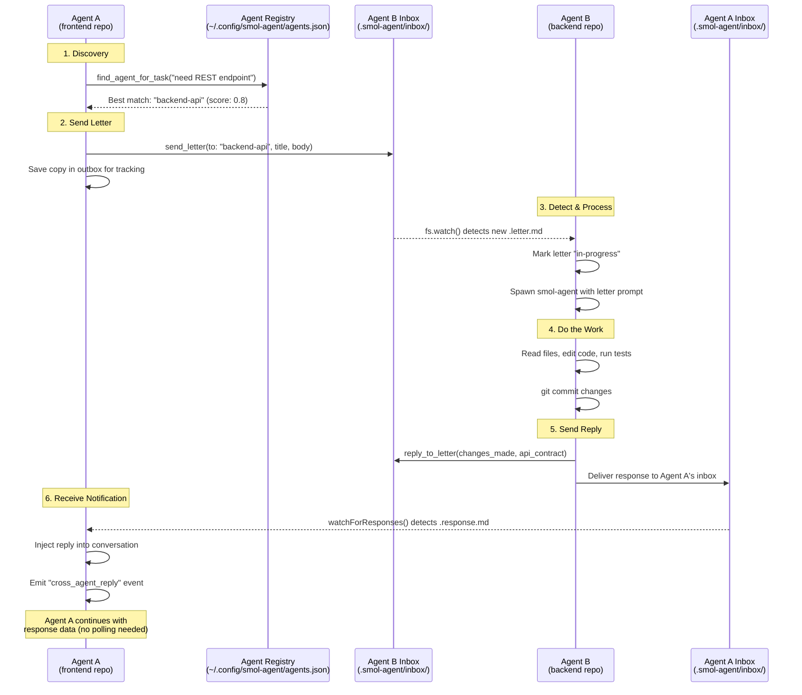
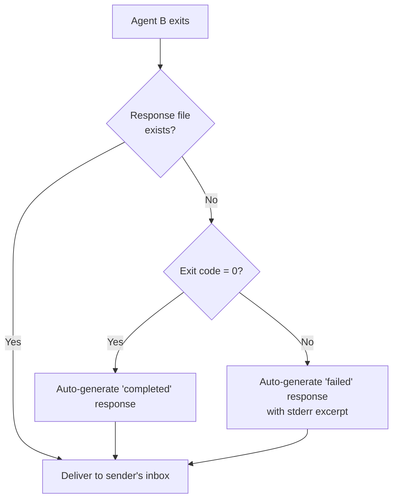
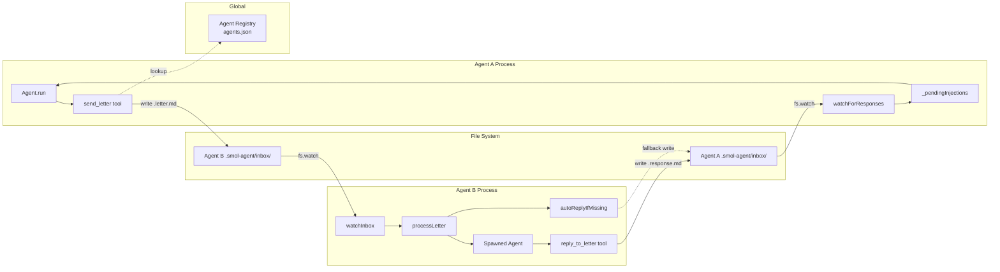

# Cross-Agent Communication Protocol

This document describes how smol-agent instances communicate across repositories
using the inbox/letter protocol.

## Overview

Agents communicate by dropping markdown "letters" into each other's `.smol-agent/inbox/`
directories. A watcher process detects new letters, spawns an agent to handle them,
and ensures a response is always delivered back to the caller.

## Flow Diagram



## Auto-Reply Safety Net

If the spawned agent exits without calling `reply_to_letter`, the system
auto-generates a response:



## Directory Layout

```
repo-a/                              repo-b/
  .smol-agent/                         .smol-agent/
    inbox/                               inbox/
      <uuid>.letter.md    <-- sent -->     <uuid>.letter.md
      <uuid>.response.md  <-- recv <--    <uuid>.response.md
    outbox/                              outbox/
      <uuid>.letter.md (tracking copy)
```

## Letter Format

### Request (`.letter.md`)

```markdown
---
id: 550e8400-e29b-41d4-a716-446655440000
type: request
title: Add user avatar field to GET /users
from: /home/user/frontend
to: /home/user/backend-api
in_reply_to:
status: pending
priority: medium
created_at: 2026-03-09T12:00:00.000Z
---

# Add user avatar field to GET /users

## Body

The frontend needs an `avatar_url` field in the GET /users response...

## Acceptance Criteria

- GET /users returns avatar_url field
- Field is nullable (not all users have avatars)

## Context

Frontend component: src/components/UserList.tsx
```

### Response (`.response.md`)

```markdown
---
id: 660e8400-e29b-41d4-a716-446655440001
type: response
title: Add user avatar field to GET /users
from: /home/user/backend-api
to: /home/user/frontend
in_reply_to: 550e8400-e29b-41d4-a716-446655440000
status: completed
priority: normal
created_at: 2026-03-09T12:05:00.000Z
---

# Re: Add user avatar field to GET /users

## Changes Made

Added `avatar_url` (nullable string) to the User model and GET /users response.

## API Contract / Interface

GET /users now returns: `{ id, name, email, avatar_url: string | null }`

## Notes

Migration required: `npm run db:migrate`
```

## Notification Modes

| Mode | How it works | When to use |
|------|-------------|-------------|
| **Auto-notification** | `watchForResponses()` injects reply into conversation | Default - agent is notified automatically |
| **Blocking wait** | `send_letter(wait_for_reply: true)` blocks until reply | When you need the result before continuing |
| **Manual poll** | `check_reply(letter_id)` checks for response | Re-reading a specific reply |

## Architecture Components


